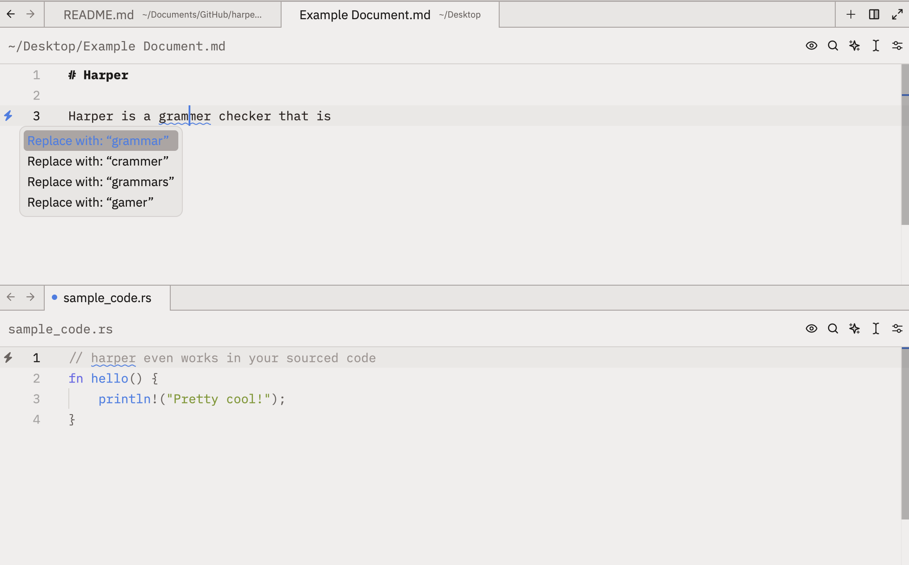
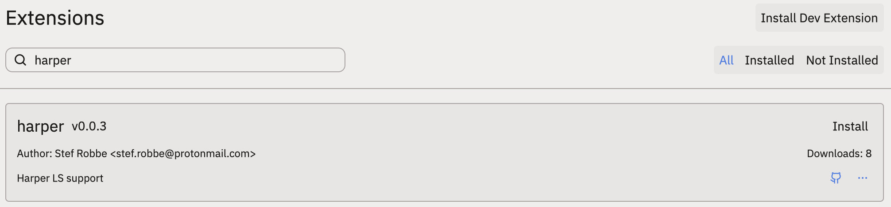

# harper_zed

Zed extension for the
[Harper Grammar Checker](https://github.com/elijah-potter/harper) LS.



## Supported platforms

| Platform | X86_64 | ARM64 |
|---|---|---|
| Linux | ✅ | ✅ |
| MacOS | ✅ | ✅ |
| Windows | ✅ | ❌ |

## Install

1. [Open the Extension Gallery](https://zed.dev/docs/extensions/installing-extensions)
2. Search for `harper` in the Gallery
3. Click "Install"!



## Configuration

The extension is configured via the `lsp` section of your zed settings.
Additional info can be found [here](https://github.com/elijah-potter/harper/tree/master/harper-ls).
```json
"lsp": {
  "harper-ls": {
    "binary": {
      "path": "/path/to/harper-ls"
    },
    "settings": {
      "harper-ls": {
        "userDictPath": "~/dict.txt",
        "fileDictPath": "~/.harper/",
        "diagnosticSeverity": "hint", // hint, warning, error, information
        "linters": {
          "spell_check": true,
          "spelled_numbers": true,
          "an_a": true,
          "sentence_capitalization": true,
          "unclosed_quotes": true,
          "wrong_quotes": false,
          "long_sentences": true,
          "repeated_words": true,
          "spaces": true,
          "matcher": true,
          "correct_number_suffix": true,
          "number_suffix_capitalization": true,
          "multiple_sequential_pronouns": true,
          "linking_verbs": false,
          "avoid_curses": true,
          "terminating_conjunctions": true
        },
        "codeActions": {
          "forceStable": false // Force code actions to appear in "stable" positions
        }
      }
    }
  }
},
```

## Acknowledgments

- [elijah-potter](https://github.com/elijah-potter) for creating Harper
- [WeetHet](https://github.com/WeetHet) for their
  [typst LS extension](https://github.com/WeetHet/typst.zed) which was used as
  inspiration for this repository :)
